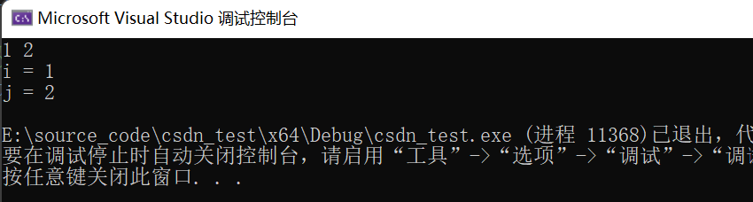

# ACM输入输出模式
## 一、什么是ACM输入输出模式？
ACM（ACM国际大学生程序设计竞赛）是一项广泛进行的编程竞赛，旨在考察参赛者在计算机科学和算法方面的能力。在ACM竞赛中，所需数据通常使用标准输入的方式给出，参赛者需要自行设计读取数据和输出数据的程序。与之相对应的是LeetCode的**核心代码模式**，在核心代码模式中，所要实现的功能封装于给定函数中，所需数据可以直接使用，用户只需返回结果即可。

## 二、标准输入流
### （一）头文件
~~~cpp
#include <iostream>
~~~
### （二）输入流对象std::cin
std::cin是一个C++输入流对象，它允许用户从标准输入设备（通常是键盘）读取数据。
#### 1.输入方法
使用 std::cin 读取基本数据类型（如 int、double、char）时，获取到的数据将存入 std::cin 对象本身，程序通过使用**提取运算符（Extraction Operator）** ">>" 获取相应的数据并存入指定的变量中。注意每一次使用提取运算法只能提取一个值，但 std::cin 允许链式调用，所以也可以通过在一个 std::cin 后添加多个提取运算符的方式读取多个值。
~~~cpp
#include<iostream>
using namespace std;

// cin的链式输入，每遇到空格或换行符停止对当前数据的读取，准备读取下一个直到终止
int main() {
	int i, j;
	cin >> i >> j;
	cout << "i = " << i << endl;
	cout << "j = " << j << endl;
}
~~~

#### 2.状态检查
如果 std::cin 遇到无效输入（例如尝试将非整数输入到 int 变量中或无输入），它的返回值将为 false；如果 std::cin 成功读取到符合数据类型的数据，返回true。这常用于检测输入操作是否成功。
~~~cpp
// example 1
int num;
if (std::cin >> num) {
    // 输入成功
} else {
    // 输入失败
}
~~~
同时，注意这个特性还常和while循环搭配用于读取**不知道具体数量**的数据。
~~~cpp
int n;
vector<int> nums;
while(cin >> n) {
    nums.push_back(n);
}
~~~
#### 3.终止条件
**预先指定次数**
~~~cpp
int count;
vector<int> nums;
cin >> count;
for(int i = 0; i < count; i++) {
    int elm;
    cin >> elm;
    nums.push_back(elm);
}
~~~
**特殊值标记法**
~~~cpp
/*
POJ 2259.team queue团队排队问题
输入：
ENQUEUE 102
ENQUEUE 202
ENQUEUE 101
ENQUEUE 302
DEQUEUE
DEQUEUE
STOP
*/
void excute()
{
    int peopleID,teamID;
    string command;
    cout << "Scenario #" << Scenario++ << endl;
    while(cin >> command && command != "STOP")  //STOP停止
    {
        if (command == "ENQUEUE")  //ENQUEUE入队
        {
           // 略
        }
        else   //DEQUEUE出队
        {
           // 略
        }
    }
    cout << endl;
}
~~~
**文件结束标志**
文件结束标志（EOF）也可以终止输入。在终端上，通常可以使用 Ctrl+D 来触发文件结束标志。
~~~cpp
// 这段代码将持续读取整数，直到文件结束标志被触发。
int num;
while (std::cin >> num) {
    // 处理 num
}
~~~
#### 4.错误处理
std::cin也提供了一些错误处理机制。std::cin.fail()用于检查最近的输入操作是否成功。如果输入格式不符合预期，将返回true以便进行错误处理。
~~~cpp
int num;
std::cin >> num;
if (std::cin.fail()) {
    std::cerr << "输入不是整数！" << std::endl;
    // 处理错误
}
~~~
## （三）std::getline()
如果需要完整地读取一行输入（包括本行中存在的**所有空格**）可以使用 getline 函数。
~~~cpp
std::string line;
std::getline(std::cin, line);
~~~

## 三、标准输出流
### （一）头文件：
~~~cpp
#include <iostream>
~~~
标准输出流一般专指 std::cout ，它是 C++ 标准库提供的用于将数据输出到控制台或终端的输出流对象，也是程序中最常用的输出方式之一。
#### 1.基本用法
~~~cpp
string s = "Hello C++!";
cout << s;
~~~
和 cin 相似，cout 同样可以进行链式输出，注意输出的数据之间**没有空格**作为分割。
~~~cpp
string name;
std::cin >> name;
cout << "Hello " << name << " !";
~~~
#### 2.控制输出格式
**换行**
~~~cpp
// example 1
cout << 10 << endl;
cout << 15 << endl;
/*
输出：
10
15
*/
//example 2
cout << 10;
cout << endl;
cout << 15;
/*
输出：
10
15
*/
~~~
**控制小数位数**
~~~cpp
int x = 42;
double pi = 3.14159;

// std::setw(10)设置了输出字段的宽度为 10 个字符
// 这意味着输出的整数 x 将会占用 10 个字符的宽度，如果不足 10 个字符，将会使用空格填充。
std::cout << "x: " << std::setw(10) << x << std::endl;
// 将以固定小数位数（两位小数）的格式输出 pi。
std::cout << "pi: " << std::fixed << std::setprecision(2) << pi << std::endl;
~~~
## 四、文件输入流
### （一）头文件
``````cpp
#include <fstream>
``````
首先需要建立一个文件输入流对象并指定输入文件的文件名，然后使用输入流对象名替换cin即可，注意在使用完毕以后调用close函数关闭输入流。
~~~cpp
#include <fstream>
using namespace std;

ifstream input("in.txt");
// 检查文件是否可以被正常打开
if (!input.is_open()) {
    cerr << "Error: Cannot open input file." << endl;
    return 1;
}
int count = 0;
input >> count;
vector<int> nums;
for(int i = 0; i < count; i++) {
    int elm;
    input >> elm;
    nums.push_back(elm);
}
~~~

## 五、文件输出流
### （一）头文件
``````cpp
#include <fstream>
``````
### （二）用法
首先需要建立一个文件输出流对象并指定输出文件的文件名，然后使用输出流对象名替换cout即可，注意在使用完毕以后调用close函数关闭输出流。
~~~cpp
#include <fstream>
// 建立输出流对象
std::ofstream outputFile("output.txt");

if (outputFile.is_open()) {
    outputFile << "This is written to a file." << std::endl;
    outputFile.close();
} else {
    std::cout << "Unable to open the file." << std::endl;
}
~~~